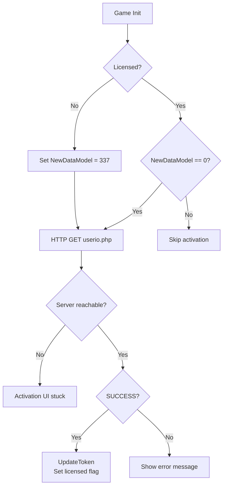
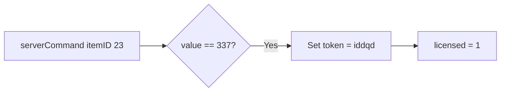

A friend mentioned to me that a game currently sold on Steam is unplayable. It softlocks on the main menu, and you have to forcibly Alt+F4 out of the game.

This seemed like a fun night adventure, so off we went. Given that this is an older Unity title, I chose client-side decompilation over traffic interception.

My goals were to understand the "custom" DRM implemented, as well as whether the game was truly dead or if it had fail-safes. I've also documented the internal licensing API and custom cloud saving below.

For clarity, this is not an analysis on how to implement cross-platform saving, licensing and monetization solutions, but the opposite. Alongside severe design flaws, the code reveals extreme security concerns such as:

- No HTTPS;
- No crypto;
- Incomplete HMAC-style validation;
- No signature or binary verification;
- Extremely simple license state tracking;
- No replay protection.

## Target

- Architecture: PC (32-bit)
- Protections: .NET Reactor, basic hashing

## Tools

- dnSpyEx (32-bit, for breakpoints)
- de4dot (mobile46's fork)

## Analysis

The first behavior I noticed is a curious error within the game's log:

```text
ProtectedPad, verifyPaidVersion() ERROR: Could not resolve host: jrex.srj-studio.com; Host not found
```

Opening the assembly `\JReX\jrex_Data\Managed\Assembly-CSharp.dll` in dnSpyEx revealed a familiar sight: obfuscated classes, strange string decryptors with hundreds of switch cases, and incorrectly named arguments for functions.

```csharp
internal static byte[] rdNar2g86(byte[] \u0020)
{
    ...
    GOZuFrNRq1XKEntOOO.p03EDr9is(ref num7, num8, num9, num10, 0U, 7, 1U, array);
    GOZuFrNRq1XKEntOOO.p03EDr9is(ref num10, num7, num8, num9, 1U, 12, 2U, array);
    GOZuFrNRq1XKEntOOO.p03EDr9is(ref num9, num10, num7, num8, 2U, 17, 3U, array);
    GOZuFrNRq1XKEntOOO.p03EDr9is(ref num8, num9, num10, num7, 3U, 22, 4U, array);
    GOZuFrNRq1XKEntOOO.p03EDr9is(ref num7, num8, num9, num10, 4U, 7, 5U, array);
    GOZuFrNRq1XKEntOOO.p03EDr9is(ref num10, num7, num8, num9, 5U, 12, 6U, array);
    GOZuFrNRq1XKEntOOO.p03EDr9is(ref num9, num10, num7, num8, 6U, 17, 7U, array);
    ...
}
```

This would immediately break any attempt to recompile code outside of IL and be a chore to map. Tossing it into `de4dot` fixes this issue while maintaining it coherent to the game itself.

```text
de4dot v3.1.41592.3405

Detected .NET Reactor (C:\Data\Dev\de4dot\Release\net45\Assembly-CSharp.dll)
```

With the trivial obfuscation out of the way, we can start mapping the game's DRM.

### Internal ID handling and savegames

We'll first go over how the game assigns a player to its saving and licensing implementation.

Since the game is cross-platform, it uses a mix of Steam ID or a device ID provided by Unity's [deviceUniqueIdentifier](https://docs.unity3d.com/6000.0/Documentation/ScriptReference/SystemInfo-deviceUniqueIdentifier.html).

```csharp
// Token: 0x06000740 RID: 1856 RVA: 0x00037E60 File Offset: 0x00036060
 public static string GetUserID(bool forcesteamid = false)
 {
  if (Application.isEditor) // Unity editor case
  {
   return "76561198178452025"; // probably the developer's steam ID
  }
  if (forcesteamid)
  {
   return SteamUser.GetSteamID().m_SteamID.ToString();
  }
  if (PlayerPrefs.GetInt("NewDataModel", 0) > 300)
  {
   return SteamUser.GetSteamID().m_SteamID.ToString();
  }
  return SystemInfo.deviceUniqueIdentifier;
 }
```

This ID is hashed and used in a simple XOR scheme to discourage local save tampering or sharing:

```csharp
using (SHA1 sha = new SHA1Managed())
  {
   array = sha.ComputeHash(Encoding.UTF8.GetBytes(GlobalStatic.GetUserID(false)));
  }
// Token: 0x06001B4E RID: 6990 RVA: 0x000A243C File Offset: 0x000A063C
 private byte[] decode(int offset, int size)
 {
  byte[] array = new byte[size];
  for (int i = 0; i < size; i++)
  {
   array[i] = this.SDQ[(int)this.FDA[i + offset]] ^ this.lDV[(int)this.FDA[i + offset]];
  }
  return array;
 }

 // Token: 0x06001B4F RID: 6991 RVA: 0x000A2484 File Offset: 0x000A0684
 private void encode(byte[] arr, int offset, int size)
 {
  for (int i = 0; i < size; i++)
  {
   this.SDQ[(int)this.FDA[i + offset]] = arr[i] ^ this.lDV[(int)this.FDA[i + offset]];
  }
  this.saveToPrefs(false);
 }
```

An unused hash test call reveals `http://jrex.srj-studio.com/_sysio/itemshop/hasher.php`, an attempt at HMAC in which it verifies for parity between client and server.

```csharp
float res = (float)(hashed ^ lint) * 0.0001f;
Debug.Log("Remote int: " + res);
```

Notably, the savegame is decrypted client-side before being sent to the custom cloud service.

### Licensing, states and why it softlocks

We can now piece together how the game obtains a license, and why a network failure results in a broken game.

Our fun begins with tracking down *how* the game checks for a license. It partially uses Steam's ticket, but still requires their server to validate it.



Traversing `verifyPaidVersion()`, we find `activationProcess()`. This function sends the Steam authentication ticket to `http://jrex.srj-studio.com/_sysio/activation.php`, which returns a status value stored in `this.RDU`.

```csharp
private void Start()
{
  ...
  GlobalStatic.verifyPaidVersion(1);
}

public static int verifyPaidVersion(int phase)
{
 return GlobalStatic.cGg.verifyPaidVersion(phase);
}

private IEnumerator activationProcess()
 {
  WWW www;
  if (!(GlobalStatic.userTicket == string.Empty))
  {
   this.RDU = 0; // This is our "activation process" state
   string url = "http://jrex.srj-studio.com/_sysio/activation.php?token=" + GlobalStatic.userTicket;
   www = new WWW(url);
   yield return www;
  }
  ...
  return 1; // coroutine decompilation weirdness
  if (www.error == null)
  {
   goto IL_00BF;
  }
  Debug.LogError("ProtectedPad, verifyPaidVersion() ERROR: " + www.error);
  yield break;
  IL_00BF:
  if (!www.text.Contains("ERROR"))
  {
   goto IL_00E4;
  }
  this.RDU = -1; // Failed to verify. The code handles this in case of server error
  goto IL_0106;
  IL_00E4:
  this.decodeDefaultValues(www.text);
  this.RDU = 2; // License activated
  IL_0106:
  yield break;
 }
```

The `RDU` variable is reused throughout the game for multiple transactional operations. A global, mutable transaction state variable reused across unrelated asynchronous flows, with inconsistent success values and no formal state contract.

| Value | Activation Flow Meaning | Item Transaction Meaning | Notes |
|-------|--------|---------|
| -2 | — | Invalid token | Server integrity mismatch |
| -1 | Activation failed | Generic failure (possible) | Used as negative error |
| 0 | Checking / pending | In-progress | Set before request |
| 1 | — | Transaction success | Not used for activation success |
| 2 | Activation success | — | Activation-specific success |
| >2 | — | Server-defined status | Parsed directly from response |

There is no unified success code.
Activation considers >1 success, transactions consider 1 success.

This coroutine has no offline fallback. The activation UI waits for `RDU` to change from 0. On network failure, the coroutine exits early and `RDU` remains 0 indefinitely.

```csharp
Debug.LogError("ProtectedPad, verifyPaidVersion() ERROR: " + www.error);
yield break;
```

It locks the game completely, never clearing the forced activation window. The free trial version is not accessible to the player either.

The game also attempts to recover a "licensed" save from their cloud system, but since the servers are down and it doesn't use Steam Cloud, it can never recover from the softlock.

It is possible that older saves carry over the license state and avoid the softlock, provided they were created on later game versions. However, since it lacks Steam Cloud, uninstalling the game means forever losing the license state.

```csharp
if (resultCode > 1)
   {
    if (PlayerPrefs.GetInt("NewDataModel", 0) == 336)
    {
     GlobalStatic.LoadFromCloud(new GlobalStatic.CallbackFunc(this.restoreFromCloudResult));
    }
    PlayerPrefs.SetInt("paidChecked", 1);
    ...
   }
   else
   {
    ...
    this.retryButton.gameObject.SetActive(true);
   }
```

### Found backdoors

Internal code reveals a few interesting backdoors. Of note, a DOOM reference that unlocks your game to the full version, some debug license, and the "free trial" code.



```csharp
if (itemID == 23 && (int)value == 337)
  {
   PlayerPrefs.SetString("token", "iddqd");
   PlayerPrefs.SetInt("licensed", 1);
  }

if (this.svW == "IDKFA")
  {
   PlayerPrefs.DeleteAll();
   Debug.Log("Free All Props!");
   this.licMessage.parent.parent.gameObject.SetActive(false);
  }
if (this.svW == "top50")
  {
  }

public void RequestFreeLicense()
 {
  if (!this.Yve)
  {
   this.Yve = true;
   this.svW = "IWANNAFREE";
   base.StartCoroutine(this.SendLicense());
  }
 }
```

## Postmortem of implementation

Without diving yet on whether using such an implementation warranted use, let's see what we could have done to better improve the current code.

### Network resilience failure

The lack of proper fallbacks such as obtaining licenses from Steamworks, or license caches, means the game is stranded.
Better timeout and retries/bouncing on network attempts and coroutines would have meant that even on exceptions, the user would not be stuck. Additionally, the UX would have greatly improved when the game was "alive".

### State management failure

This is possibly the "biggest" flaw in the design.
States have several blind spots, reusing a global "mutex" for the transaction model, server state injecting anonymously and poorly defined values for `RDU` means the state management is in complete disarray. This makes testing and reasoning about client behavior significantly harder.

Allowing the server to inject loosely defined state values makes it difficult to correlate client behavior with specific API calls. The UI was defaulting to "waiting" on the transaction, when `RDU` does not even define a "wait" state, falling into undefined behavior.

### Platform integration failure

When sold on Steam, there is an implicit expectation that Steam authentication alone is sufficient to access the purchased product.

The absence of Steam Cloud support removed a critical recovery mechanism for license state persistence.

## What now?

As of posting this, you can still purchase this game. Out of over 1000 reviews (per SteamDB), many report complete inability to play. A new user can't play it, uninstalling it means revoking your access, and any money spent on micro-transactions is gone too.

The last update was in 13 August 2016, per [SteamDB](https://steamdb.info/app/385270/patchnotes/), and the developer's website `http://srj-studio.com` (which hosted the APIs) has been down since roughly 2021. They have since moved to <https://real-dynamics.ru>, but unfortunately the redirect no longer works.

Back in the early 2010s, there were not as many good solutions for cross-platform situations such as these. Ensuring whether the fallbacks work would have been a start, or a post-abandonment update removing the custom DRM entirely.

Preservation efforts towards projects like these are difficult, due to legal and grey areas. While intentions were good, architectural and implementation issues have stranded the product. The DRM did not fail because it was malicious. It failed because it was tightly coupled to infrastructure that had no end-of-life plan.

> This analysis is intended for documentation and preservation purposes. No instructions for bypassing licensing are provided, and no modifications are distributed.
